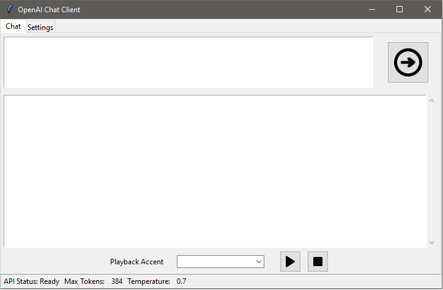
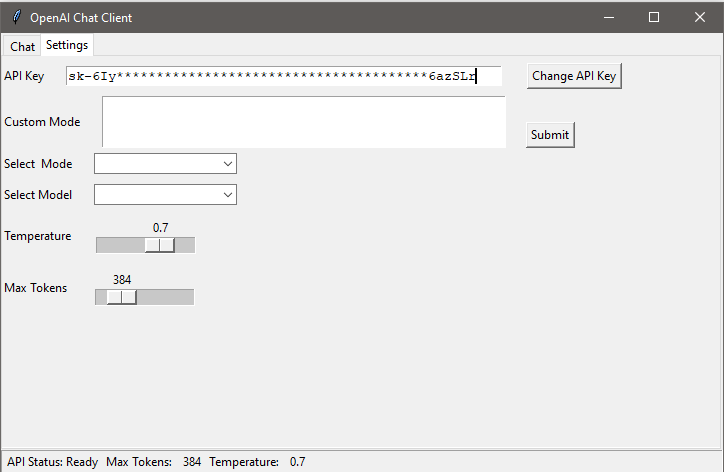

# chatgpt_client

This is my efforts to make a chat client for the OpenAI api

## Current State
     tkinter UI
     Simple chat box with display for conversation
     Tabs for Chat and Settings
     Checks for env set api key
     Options to manually set api key
     sliders to adjust some model settings
     
## Goals
    Add different models
    Add option for settings file
    Add ability to save and view conversations 

## Chat Tab

## Settings Tab
